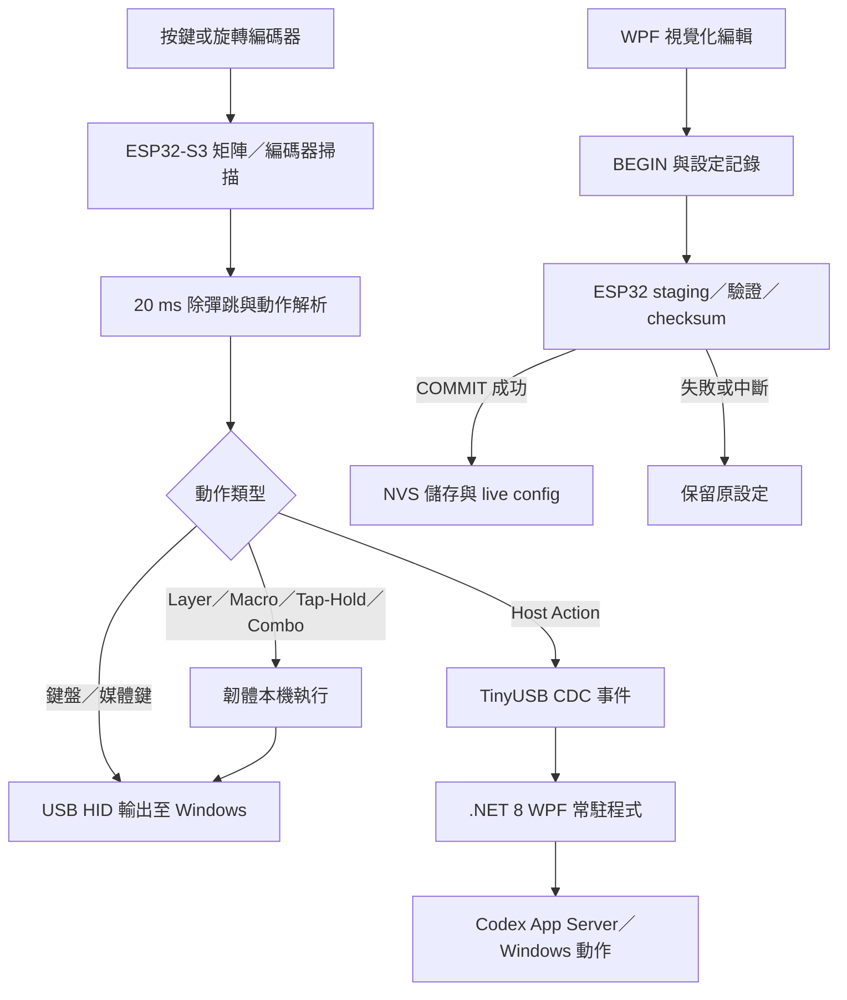

### 🚀 Codex Macro S3 — 從矩陣掃描到桌面設定器的巨集鍵盤

Codex Macro S3 是一套結合自製 PCB、ESP32-S3 韌體與 Windows 桌面程式的巨集鍵盤原型。硬體以 4×3 矩陣讀取 11 個按壓位置，並加入旋轉編碼器；同一條 USB 連線同時負責鍵盤／媒體鍵輸出與裝置設定。使用者可透過 .NET 8 WPF 介面讀取、編輯並寫回鍵位，不需要為每次配置調整重新編譯 Arduino 韌體。

一般鍵盤、layer、巨集、tap-hold 與 combo 由 ESP32-S3 本機解析，因此設定程式未開啟時仍可執行。當 Windows 程式常駐時，裝置也能透過 host action 串接 Codex App Server，操作 task、prompt、review、Skill 與 interrupt；涉及 Codex 核准的要求則保留在視窗中供使用者審閱。

### 核心特色

- **11 鍵矩陣與旋轉編碼器**  
  以 GPIO 5、6、7 驅動矩陣，GPIO 8、9、10、11 感測按鍵，使用 20 ms 除彈跳；編碼器 A／B 使用 GPIO 12、13。4×3 位置中左上 slot 0 固定為未安裝，共有 11 個可按壓位置，另提供順、逆時針動作。

- **單一 USB 的雙通道設計**  
  USB HID 直接輸出鍵盤與 Consumer Control 動作；TinyUSB CDC 以 115200 baud 傳送設定命令與 host action 事件，讓輸入與設定共用同一條 USB-C 連線。

- **可離線執行的進階鍵位**  
  韌體支援 1–8 個可命名 layer，以及 Hold、Toggle、Switch、Transparent 等切換方式；配置容量包含最多 32 個巨集、32 個 tap-hold 與 32 組 2–4 鍵 combo。單一巨集最多 64 步，整份 profile 共用 256 步。

- **交易式設定寫入**  
  Windows 程式先以 `BEGIN` 建立 staging 設定，再交由韌體驗證與計算 checksum；只有成功 `COMMIT` 才寫入 NVS 並切換為 live config。若寫入中斷或驗證失敗，既有設定不會被未完成的內容覆蓋。

- **Windows 原生設定工具**  
  .NET 8 WPF 程式可自動探索序列埠、辨識 protocol v3 裝置，並讀寫 layer、binding、macro、tap-hold、combo 與 Codex action。專案也包含系統匣常駐、Windows 登入時啟動，以及 self-contained、win-x64、single-file 的發布設定。

- **Codex 操作與人工核准邊界**  
  桌面程式透過 JSONL 與 Codex App Server 子程序溝通，可列出、開啟、建立與切換任務，也可傳送提示詞、繼續、中止、啟動 review、執行 Skill 或分支任務。核准要求必須在桌面視窗中檢視後處理，不由單次實體按鍵直接接受。

#### 🛠 系統架構

#### 技術規格總覽

| **規格項目** | **詳細配置** |
| :--- | :--- |
| 控制器 | ESP32-S3 SuperMini |
| 輸入配置 | 4×3 矩陣中的 11 個按壓位置；左上 slot 0 未安裝 |
| 旋轉輸入 | EC11 類旋轉編碼器，支援順／逆時針與按壓位置 |
| 開關與二極體 | 10 個 MX 軸開關、1 個 Encoder EC11／MX combo、11 顆 DO-35 二極體 |
| 裝置輸出 | USB HID Keyboard、USB HID Consumer Control |
| 設定通道 | TinyUSB CDC，115200 baud，protocol v3 |
| 韌體能力 | 1–8 layers、32 macros、32 tap-hold、32 combos |
| 持久化 | ESP32 NVS、checksum 驗證、v2 → v3 設定搬移 |
| 狀態顯示 | GPIO 48 板載 RGB LED；8 種 layer 顏色與短暫 Codex 狀態 |
| 桌面程式 | C#、.NET 8、WPF、System.IO.Ports 8.0.0 |
| PCB 工具 | KiCad 9.0.x；具備 BOM、座標、netlist 與製造 ZIP |
| 建置目標 | ESP32S3 Dev Module；Windows self-contained win-x64 single-file |

### 已提交版本與持續開發內容

目前可確認的軟體 Git 歷史包含 2026-08-04 的 3 個 commit。`main`／`origin/main` 的 HEAD 為 `5dcb355`：初始提交已納入 protocol v3 韌體、.NET 8 WPF 程式、測試、文件與 UI 截圖；後續提交加入 Fast mode 快捷鍵，並修正 Codex App Server 的核准策略。

工作目錄另有尚未提交的桌面首頁與 device-first UI、USB CDC frame 重新同步、Codex Micro preset、Win+H 語音切換與素材調整。這些內容代表持續開發中的 working tree，**不視為目前已提交或已發布版本**。其中 Codex Micro 預設鍵位、350 ms 單擊／雙擊邏輯，以及以 Win+H 切換 Windows 語音輸入，皆不列入已提交版本成果。

### 測試與驗證

- 桌面程式的 `SelfTests.cs` 涵蓋預設 layer／slot、Codex actions、profile normalization、JSON round-trip、null collection recovery、嚴格 protocol parser、無效設定原子性、approval policy 與重複 approval ID 的 fail-closed 行為。
- 盤點時以既有 .NET build 執行 `--self-test`，exit code 為 **0**。該 DLL 建置時間為 2026-08-11；由於來源仍有未提交變更，此結果不能代表目前 working tree 已重新建置並全部通過。
- 專案保留多組韌體 `.bin`、`.elf` 與 `.map`，可確認韌體曾成功編譯，但建置產物本身不能證明已燒錄或通過實機驗收。
- KiCad 最新 PCB DRC 報告為 0 violation、0 unconnected pad、0 footprint error；原理圖 ERC 則仍有 20 errors、3 warnings。
- UI smoke 模式與介面截圖可確認畫面曾成功產生；Codex smoke test 程式存在，但盤點時未執行，因此不宣稱其測試已通過。

### 目前限制

- 軟體 working tree 含大量未提交變更，現行 README、來源碼與 `main` HEAD 並非完全相同版本。
- PCB 原理圖仍使用 `WEMOS_C3_mini` 符號，PCB 則採 ESP32-S3 SuperMini footprint，且 MCU reference 尚為 `REF**`；此一致性問題與 ERC 錯誤仍待釐清。
- 目前資料沒有實機長期使用、按鍵漏觸／鬼鍵、旋鈕方向、USB 重連、NVS 斷電保存或 Codex host action 成功率的量測紀錄，因此不對穩定性做超出證據的宣稱。
- 設計素材中的 Bluetooth 與 100% 電量圖示沒有對應的通訊協定或遙測證據，不能視為已完成的藍牙或電量功能。
- 尚未找到可確認的完成品實拍、操作影片、外殼 CAD／STL，亦無足以證明社課實施成果或個人分工的紀錄。
- 專案目前未附專案層級 `LICENSE`；若要公開原始碼、PCB 製造資料或第三方素材，仍需先確認授權與公開範圍。
