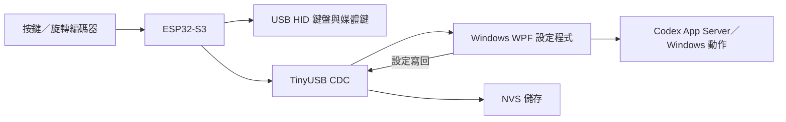

### Codex Macro S3 巨集鍵盤

Codex Macro S3 是一套以 **ESP32-S3** 為核心的 11 鍵巨集鍵盤原型，包含自製 PCB、韌體與 Windows 設定程式。設計目標是讓鍵位可以從圖形介面調整，不必每次修改配置都重新編譯並燒錄韌體。

鍵盤本身可執行一般按鍵、媒體控制、layer、巨集、tap-hold 與 combo。需要電腦端配合的動作則透過 USB 傳給 WPF 常駐程式，包括操作 Codex 任務與呼叫 Windows 功能。即使設定程式沒有開啟，基本鍵盤功能仍能由 ESP32-S3 獨立完成。

### 硬體與輸入配置

- 4×3 矩陣中使用 11 個按壓位置，並加入一顆可按壓的旋轉編碼器。
- 矩陣掃描採用 20 ms 除彈跳，編碼器可分別設定順時針與逆時針動作。
- GPIO 48 的板載 RGB LED 用來表示目前 layer 與短暫的 Codex 操作狀態。
- KiCad 專案包含原理圖、PCB、BOM、座標、netlist 與製造輸出。

### USB 與設定架構

同一條 USB-C 連線同時負責兩種工作：USB HID 輸出鍵盤與媒體鍵，TinyUSB CDC 則傳送設定命令和電腦端動作。這樣不需要額外的通訊線，也能讓裝置維持標準鍵盤的使用方式。

設定寫入採用 staging 流程。Windows 程式先送出 `BEGIN` 和完整配置，韌體完成格式驗證與 checksum 後才接受 `COMMIT`，並將資料寫入 NVS。若傳輸中斷或內容無效，原本的設定不會被未完成的資料覆蓋。

```mermaid
flowchart LR
    A[按鍵／旋轉編碼器] --> B[ESP32-S3]
    B --> C[USB HID 鍵盤與媒體鍵]
    B --> D[TinyUSB CDC]
    D --> E[Windows WPF 設定程式]
    E --> F[Codex App Server／Windows 動作]
    E -->|設定寫回| D
    D --> G[NVS 儲存]
```

### Windows 設定程式

設定工具使用 **C#、.NET 8 與 WPF** 開發，可讀取並編輯 layer、binding、macro、tap-hold、combo 與 Codex action。韌體目前支援最多 8 個 layer、32 個巨集、32 個 tap-hold 和 32 組 combo。

Codex 相關操作由桌面程式透過 JSONL 與 Codex App Server 溝通。實體按鍵可以啟動任務、傳送提示、進行 review 或中止工作，但核准要求仍保留在桌面視窗中，由使用者確認後處理，避免把高風險操作綁定成單次按鍵。

### 測試與目前進度

- 桌面程式已建立涵蓋設定正規化、JSON 讀寫、protocol parser、無效設定處理與核准策略的 self-test；既有建置產物執行測試的 exit code 為 0。
- 韌體目錄保留 `.bin`、`.elf` 與 `.map`，表示專案曾完成編譯；仍需以目前來源重新建置並進行實機測試。
- PCB 的最新 DRC 報告為 0 violation，但原理圖 ERC 仍有 20 errors 和 3 warnings。MCU 符號與 ESP32-S3 footprint 的一致性也需要在下一版修正。

目前優先工作是整理軟體版本、修正原理圖 ERC，並驗證按鍵掃描、旋鈕方向、USB 重連、NVS 斷電保存及電腦端動作。這些項目完成前，專案仍定位為開發中的原型，而不是已完成長期穩定性驗證的產品。
