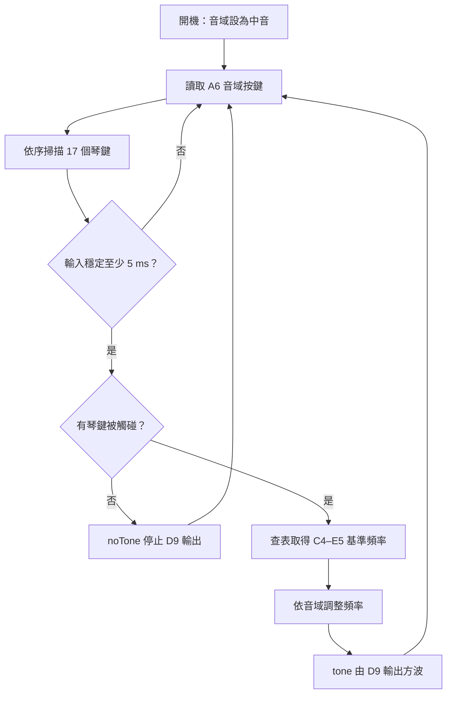

### 🚀 Arduino 17 鍵觸控筆電子琴

這是一款以 **Arduino Nano** 為核心的實體互動電子琴。使用者將金屬觸控筆接地，碰觸 17 個導電琴鍵，即可選取 **C4 至 E5** 的半音階；兩顆控制按鍵則能在低、中、高三段音域之間切換。

專案不只包含琴鍵掃描與方波發聲程式，也將 Arduino Nano、蜂鳴器、音域按鍵、電源與琴鍵接觸區整合至雙層 PCB。現有資料包含 KiCad 原理圖、PCB 佈局，以及 BOM、Gerber 與鑽孔等製造輸出。

### 核心特色

- **17 鍵半音階輸入**  
  17 個琴鍵對應 C4 至 E5；程式依序掃描輸入，並以固定優先順序處理同時觸碰的多個琴鍵。

- **接地觸控筆互動**  
  觸控筆連接 GND，碰觸金屬琴鍵後使對應輸入由上拉高電位轉為 `LOW`，形成直接的實體演奏介面。

- **三段音域切換**  
  低、中、高三段音域分別將基準頻率除以 2、維持原值或乘以 2。每次有效按壓只切換一級，放開後仍保留目前音域；重新開機則回到中音域。

- **單一類比腳位辨識雙按鍵**  
  兩顆音域按鍵透過電阻網路共用 A6，程式依類比讀值門檻判斷降音域或升音域控制。

- **輸入穩定與即時更新**  
  琴鍵與音域控制都具有 5 ms 穩定判定；琴鍵持續發聲時，音域變更會立即套用至輸出頻率。

- **PCB 與製造資料**  
  KiCad 9 專案包含雙層 PCB、琴鍵銅箔、元件配置、板框與安裝孔，並已有一份 BOM、Gerber、座標與鑽孔輸出。

#### 🛠 系統流程

1. Arduino 開機，音域初始為中音。
2. 程式讀取 A6，辨識音域按鍵產生的類比電壓區間。
3. 程式依序掃描 17 個琴鍵，輸入穩定至少 5 ms 後才更新狀態。
4. 有琴鍵被觸碰時，程式查表取得 C4–E5 的基準頻率。
5. 頻率依目前音域除以 2、維持不變或乘以 2。
6. D9 使用 `tone()` 輸出方波；放開琴鍵後以 `noTone()` 停止發聲。
7. 序列監控器以 115200 baud 輸出開機訊息與成立的琴鍵編號，供除錯使用。

#### 🛠 技術規格總覽

| **規格項目** | **詳細配置** |
| :--- | :--- |
| 控制核心 | Arduino Nano／ATmega328P |
| 琴鍵輸入 | 17 個導電琴鍵與接地金屬觸控筆 |
| 音高範圍 | C4–E5 半音階，搭配低／中／高三段音域 |
| 聲音輸出 | D9 `tone()` 方波；設計資料包含蜂鳴器 |
| 音域控制 | 兩顆按鍵共用 A6 類比輸入與外部電阻網路 |
| 輸入處理 | 5 ms 穩定判定；多鍵固定優先順序 |
| 除錯介面 | USB／UART Serial，115200 baud |
| PCB | KiCad 9 雙層板，約 111.5 × 48 mm、1.6 mm 板厚、四個約 3.2 mm 安裝孔 |
| 程式 | Arduino C/C++，使用 Arduino Core 內建 API，主程式無第三方函式庫 |
| 製造資料 | BOM、座標、IPC netlist、Gerber 與 PTH／NPTH 鑽孔檔 |

### 目前狀態

目前工作區可確認主控制程式、README、KiCad 原理圖、雙層 PCB 佈局與一份製造輸出均已存在。靜態檢查顯示，主程式中的 17 個腳位、17 個頻率、琴鍵掃描、5 ms 穩定判定與三段音域邏輯，和文件描述一致。

不過，現有資料沒有 Arduino 編譯／燒錄紀錄、實體操作影像、量測結果或課堂使用紀錄，因此尚不能把完整硬體運作、實際組裝、穩定性或教學成果寫成已驗證事實。現行 PCB 的修改時間也晚於既有製造包；若要對外提供最新版製造檔，仍需重新執行 ERC／DRC、輸出並比對版本。

另有一份 PCM 取樣音效實驗程式，但其按鍵索引與腳位陣列存在可見的不一致，目前不列為正式功能。後續可在完成主程式實機測試後，再評估修正與整合音效版本。
