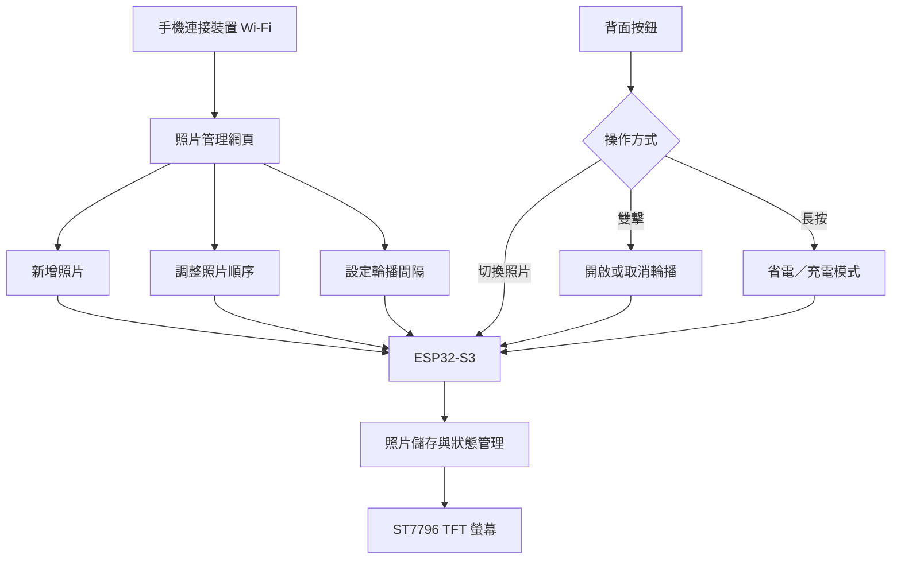

### 🚀 電子螢幕掛牌 — 用手機更新內容的可攜式顯示裝置

這是一個以 **ESP32-S3 與 ST7796 TFT SPI 螢幕**製作的可攜式電子掛牌。使用者可用手機連接裝置建立的 Wi-Fi，進入管理網頁新增照片、調整顯示順序與設定輪播間隔；離開網頁後，也能透過背面的實體按鈕切換照片與控制輪播。

目前已完成整體電路焊接、外殼建模、3D 列印與實體組裝。軟體從最初的單張照片顯示，擴充為最多 20 張照片的管理與播放系統。整套裝置已能實際操作，下一階段將處理螢幕背光、背面觸點與電路板厚度。

### 核心特色

- **手機網頁管理照片**  
  手機連接裝置建立的 Wi-Fi 後，即可開啟管理網頁。使用者不需要另外安裝 App，便能新增照片、調整照片順序與設定輪播間隔。

- **最多 20 張照片**  
  裝置目前可保存最多 20 張照片，並依照網頁中設定的順序顯示。照片資料會保存在裝置內，重新開機後仍可繼續使用。

- **自動輪播與間隔設定**  
  使用者可在網頁中啟用照片自動輪播，並調整每張照片的顯示時間。輪播模式也能透過實體按鈕開啟或取消。

- **背面實體按鈕操作**  
  背面配置兩個按鈕，可用於切換照片。其中一個按鈕連按兩下可開啟輪播，再次連按兩下則取消；另一個按鈕長按可進入省電／充電模式。

- **從電路到外殼的完整原型**  
  專案已完成電路焊接、物體建模與 3D 列印，不只停留在螢幕驅動或網頁介面的個別測試，而是已整合成可實際操作的裝置。

### 系統架構

#### 🛠 技術規格總覽

| **規格項目** | **目前配置** |
| :--- | :--- |
| 控制核心 | ESP32-S3 |
| 顯示器 | ST7796 TFT SPI 螢幕，320 × 480 直向顯示 |
| 內容管理 | 裝置自建 Wi-Fi 與手機管理網頁 |
| 照片容量 | 最多 20 張 |
| 照片控制 | 新增、排序、手動切換、自動輪播 |
| 輪播設定 | 可透過網頁調整顯示間隔 |
| 實體輸入 | 背面兩個按鈕，支援照片切換、雙擊與長按操作 |
| 資料保存 | LittleFS，重新開機後保留照片 |
| 外殼製作 | 自行建模與 3D 列印 |
| 目前硬體形式 | 模組與元件焊接組裝；尚未整合為一體式 PCB |

### 照片管理流程

1. 使用手機連接電子螢幕掛牌建立的 Wi-Fi。
2. 進入裝置提供的管理網頁。
3. 從手機新增照片，最多可保存 20 張。
4. 在網頁中調整照片的顯示順序。
5. 視需求開啟自動輪播並設定輪播間隔。
6. 設定完成後，裝置可依保存內容獨立顯示，不必持續連接手機。

手機端負責照片選擇與內容管理，ESP32-S3 則處理照片保存、顯示狀態、輪播計時與按鈕輸入。這樣能把較適合在手機上完成的操作留在網頁介面，同時讓裝置保留基本的離線控制能力。

### 實體操作

裝置背面的兩個按鈕除了切換照片，也使用不同的操作方式提供額外功能：

- 一般按壓：切換照片。
- 指定按鈕連按兩下：開啟自動輪播。
- 再次連按兩下：取消自動輪播。
- 另一個按鈕長按：停止螢幕顯示，進入省電／充電模式。

這些操作讓使用者不必每次拿出手機，也能控制常用功能。網頁主要用於照片與參數管理，按鈕則負責日常使用時的快速操作。

### 硬體與外殼

目前版本已完成整體電路焊接，並將螢幕、控制電路、按鈕與供電結構裝入自行建模及 3D 列印的外殼中。這一版先以可取得的模組和焊接方式完成整機原型，用來確認螢幕顯示、手機連線、按鍵互動與機構配置能共同運作。

實體製作後也暴露出 CAD 或單獨電路測試不容易發現的問題。背面觸點的接觸效果未達預期，而模組和接線的堆疊也增加了整體厚度。這些結果會成為下一版結構與 PCB 設計的依據。

### 測試與驗證

目前已確認以下功能可正常使用：

- 手機連接裝置網路並進入管理網頁。
- 新增及保存最多 20 張照片。
- 調整照片顯示順序。
- 手動切換照片。
- 自動輪播照片。
- 從網頁調整輪播間隔。
- 使用按鈕雙擊開啟及取消輪播。
- 使用另一個按鈕長按進入省電／充電模式。

目前沒有續航、充電電流、背光功耗或長時間穩定性的量測資料，因此不對實際省電幅度與充電效率做超出現有測試的宣稱。

### 目前問題

- **省電／充電模式無法關閉背光**  
  長按按鈕後，程式會停止螢幕顯示，但背光仍然亮著。持續點亮的背光可能增加耗電，影響充電效率。後續需要從背光控制訊號與電路配置著手，使這個模式能同時停止顯示並關閉背光。

- **背面觸點結構效果不佳**  
  原先規劃的背面觸點在實際製作後，接觸效果沒有達到預期。後續需要重新調整觸點位置、接觸方式與機構結構。

- **模組與接線增加厚度**  
  現有版本使用模組及焊接電路完成整機驗證，能正常運作，但內部堆疊仍占用較多空間。若要讓裝置更接近長期使用的成品，需要重新整合電路配置。

### 下一版規劃

1. 讓省電／充電模式能同步關閉螢幕背光。
2. 修改背面觸點結構，提高接觸穩定性。
3. 將主要電路整合成一體式 PCB，減少接線與模組堆疊。
4. 在新硬體完成後，重新驗證照片管理、輪播、按鈕與充電模式。
5. 比較新版與目前版本的實際厚度，再確認一體式 PCB 帶來的改善。

### 目前狀態

目前硬體焊接、外殼建模、3D 列印與核心軟體功能均已完成，裝置可以實際使用。照片管理、排序、輪播及按鈕操作皆已整合；尚待處理的重點是充電模式下的背光控制、背面觸點結構，以及一體式 PCB 的薄型化設計。

下一版不會以增加更多功能為優先，而是先保留現有操作流程，改善功耗、接觸穩定性與內部空間配置。
